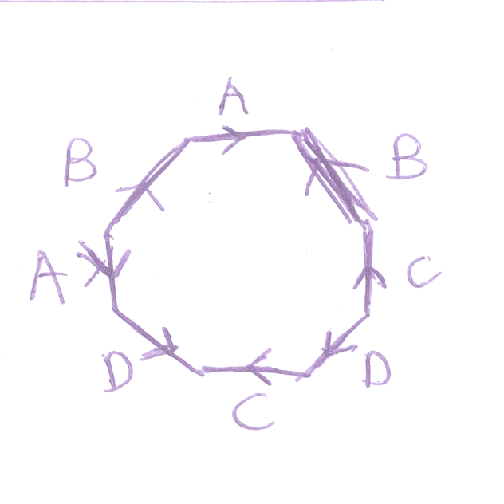
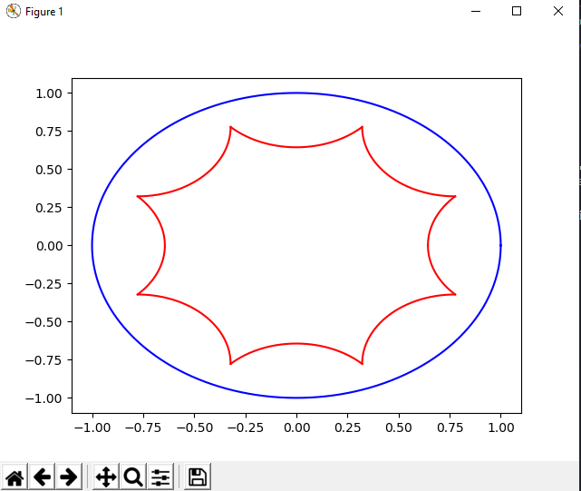
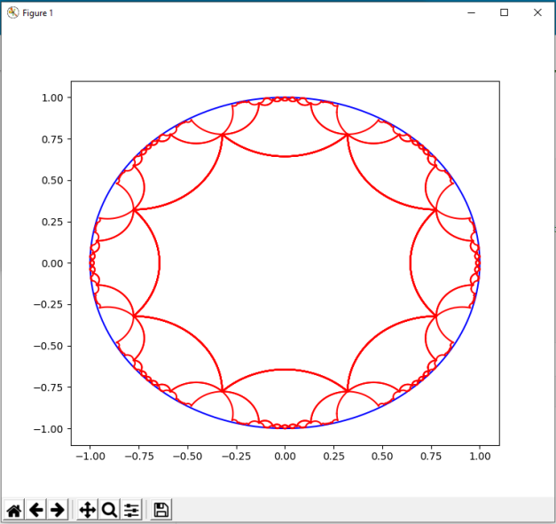

# Hyperbolic-Octagon

A visualization of a (8, 8)-tiling of the Hyperbolic Plane for Professor Richard Schwartz's **MATH 2410: Topology class** (Fall 2022 Semester) in Python. I am forever indebted to David E. Joyce's [page](http://aleph0.clarku.edu/~djoyce/poincare/index.html) which thoroughly explained how to construct a regular tiliing of the Hyperbolic Plane. This repository would not be possible without referencing his work.

## Explanation

It is well-known that we can identify edges of an Octagon as follows for it to be homeomorphic to the Double Torus: <br />

 <br />

To construct an Universal Cover of the Double Torus, the intuition is then to tile a ton of Octagons together and project down to the Double Torus with the proper identication. It's easy to see why points on the interior of the Octagon above would correspond to a covering map, and a similar argument even works for points on the edges.<br />

However, the problem occurs when we are looking at the pre-image of the vertex of the octagon.<br />

In order to form a universal cover, we'd need an Order-8 tiling of Octagons, meaning that every vertex in the graph needs to be joined by 8 octagons. This is hard to imagine in the Euclidean Space, fortunately we could accomplish this on the Hyperbolic Plane.<br />

This code illustrates an Order-8 tiling of Octagons. In this case, we note that the pre-image of the vertex of the Double Torus, under the covering map, can be split into a disjoint union of neighborhoods of each vertex in the tiling. This is because there are exactly 8 octagons meeting at each vertex in the universal cover, so each vertex of the universal cover has a neighborhood that's homeomorphic to the unit ball centered at the vertex of the Double Torus.

## How To Run

To Run the Code
```
python main.py <number of layers>
```

To Run the Web App locally
```
cd web
flask --app index.py run
```

## Visualization

This is an example with 1 layer: <br />

This is an example with 3 layers: <br />


## Note

While this code only visualizes an Octagon, I am pretty sure it would also work for any n-gon. See main.py for more details.


